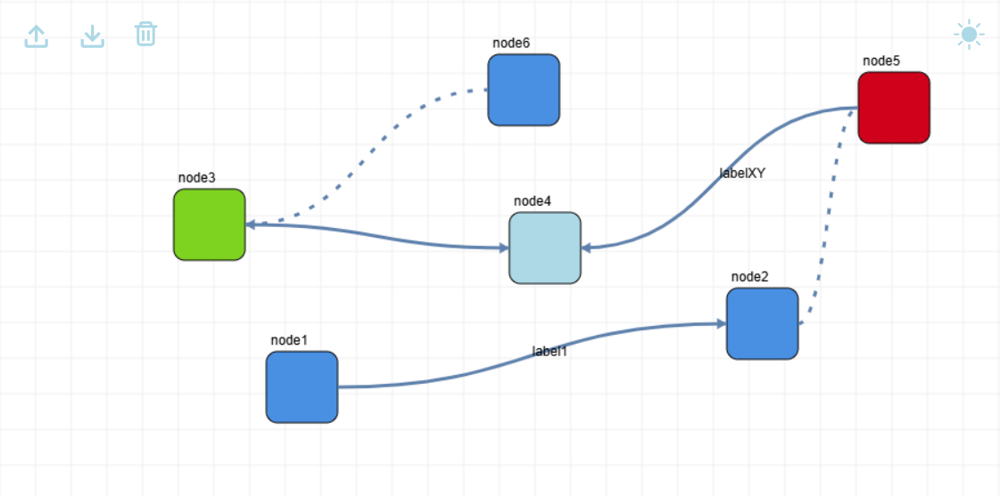

# my-node-editor

A basic node editor written in Vanilla Typescript and HTML5 Canvas API, made for studying purposes. For an Angular version check [here](https://github.com/LorenzoCorbella74/node-editor). All started from this [article](https://harrisonmilbradt.com/articles/canvas-panning-and-zooming)...

## Features
- [x] Pan and Zoom on an infinite canvas (click and drag to pan, scroll to zoom)
- [x] Add nodes (choose a node type from the provided dropdown)
- [x] Move nodes (click CTRL on the node and click and drag)
- [x] Remove nodes (click on node and press Delete key or by context menu)
- [x] Add connection (click SHIFT and drag from start node to end node)
- [x] Remove connection (click on connection and press Cancel key or from context menu)
- [x] Dark and Light mode
- [x] Save and import node graph
- [x] Labels on nodes and connections
- [x] Connection directions ('AtoB' | 'BtoA' | 'both' | 'none') and dashed line option

## TODO
- [ ] zoom level btn
- [ ] animation to create nodes
- [ ] data for nodes (sidebar ???), add nodes from context menu ???
- [ ] drag and drop nodes from custom sidebar 

## Bugs
- [ ] selection problems after zooming/panning

